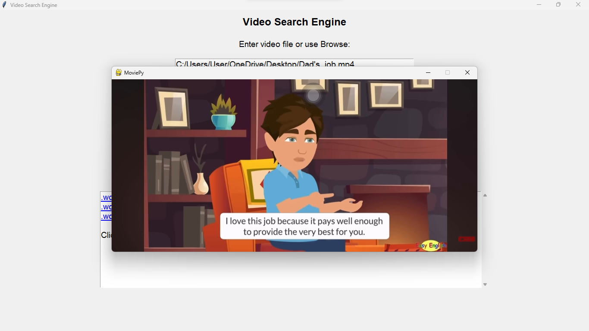

---

# 🎥 Video Search Engine  

[](https://www.python.org/)  
🚀 **A Jupyter Notebook-based video search engine** that allows users to locate specific text within video content using speech recognition and timestamps. The project utilizes **Google Speech API**, **MoviePy**, and **Tkinter** for processing and interaction.

---

## 🌟 Features  
- 🎬 Select video files in formats like `.mp4` or `.avi`.  
- 🔍 Search for specific phrases within the video's audio.  
- 🕒 Timestamps for matches are clickable to preview specific scenes.  
- 🖥️ Interactive GUI powered by Tkinter.

---

## 🖼️ Screenshots  
1. **Sample Main Interface**  
     

2. **Browse Video Interface**  
     

3. **Search Results**  
     

4. **Video Preview**  
     

---

## 📚 Prerequisites  

Ensure you have the following installed:  
- **Python 3.9+**  
- **Jupyter Notebook** or **Jupyter Lab**  
- Required Libraries:  
  ```bash
  pip install moviepy SpeechRecognition tkinter notebook
  ```

---

## ⚙️ How to Use  

1. **Clone the repository**:  
   ```bash
   git clone https://github.com/Bushra-Butt-17/video-search-engine.git
   cd video-search-engine
   ```  

2. **Run the Notebook**:  
   Open `video_search.ipynb` in Jupyter Notebook or Jupyter Lab:  
   ```bash
   jupyter notebook video_search.ipynb
   ```  

3. **Browse Video**: Select your video file by using the GUI.  

4. **Search Query**: Enter the text you want to find within the video.  

5. **View Results**: Click the timestamps to preview the specific part of the video.  

---

## 🚀 Future Enhancements  
- Expand support to additional video/audio formats.  
- Use advanced transcription APIs (e.g., AssemblyAI, Whisper) for higher accuracy.  
- Provide an option to generate subtitles or export results in text formats.

---

## 🛠️ Contributing  
Feel free to fork the repository, submit issues, or create pull requests to improve the project!  

---

## 👩‍💻 Author  

Developed by [Bushra Butt](https://github.com/Bushra-Butt-17).  

--- 
